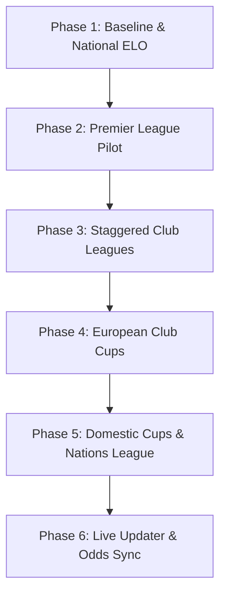

# Data Population & Sync Strategy 🏆

This document outlines a tactical, phase-by-phase ingestion and sync strategy to populate the **findfootball.games** application with real-world data following the implementation of the Phase 1–8 architecture expansion. 

To transition from mock/legacy databases to a fully updated system without exceeding external API quotas, we must schedule and divide data loads, set up local caching, and conduct rigorous integrity checks at each stage.

---

## 📊 External API Profiles & Quotas

We depend on four data sources. Managing their rate limits is critical to avoid service interruptions.

| Data Source | API Endpoint / Service | Purpose | Limit / Quota | Cost Per League |
|---|---|---|---|---|
| **API-Football** | `api-sports.io` | Teams, Rosters, Fixtures, Live Scores | **100 requests/day** (Free Tier) | **21 requests** per league (1 `teams` + 20 `players/squads` for squads) |
| **The Odds API** | `api.the-odds-api.com` | Live Bookmaker Odds | **500 requests/month** (Free Tier) | **1 request** per competition per update window |
| **ClubElo** | `api.clubelo.com` | Club ELO Ratings | No strict key limit (respect terms) | **1 request** fetches the entire global daily CSV (~3MB) |
| **EloRatings.net** | `eloratings.net` | National ELO Ratings | Public static TSV | **2 requests** fetch all national team ELOs |

> [!WARNING]
> Running squad fetching for all major leagues simultaneously (PL, La Liga, Serie A, Bundesliga, Ligue 1, Champions League) requires **over 130 API requests**, which exceeds API-Football's free daily limit. A staggered rollout is mandatory.

---

## ☁️ Execution Environment: Run on Railway (Production)

> [!IMPORTANT]
> **Do not run these ingestion scripts locally against the remote database.**
> Running migrations or massive data seeds from a local machine targeting a remote PostgreSQL database on Railway will result in extreme network latency (each SQL insert/query incurs a 50–150ms roundtrip). With thousands of rows (e.g. fixtures, players, squads), this will take hours to complete.
>
> To avoid this, **all database migrations and seeding commands must be executed directly in the Railway environment** (within the same network as the database):
> 
> ```bash
> # 1. Ensure you are logged into Railway CLI and linked to the project:
> railway login
> railway link
> 
> # 2. Run database migrations directly on Railway:
> railway run python -m alembic upgrade head
> 
> # 3. Run ingestion and seed commands directly on Railway:
> railway run python -m backend.ingestor fetch-teams --league=39 --season=2026
> ```
> This ensures database transactions execute within the same cloud datacenter, taking seconds instead of hours.

---

## 🗓️ Ingestion Rollout Roadmap



### Phase 1: Baseline & National ELO Ratings (Day 1)
* **Goal**: Establish the international team baseline and verify composite unique constraints.
* **Actions**:
  1. Fetch current international ELOs:
     ```bash
     python -m backend.ingestor apply-elo-matches
     ```
  2. Verify that the legacy 2026 World Cup data maps correctly and ELO histories are initialized.
* **Connection & Integrity Check**:
  - Run SQL query to confirm `Team` table has composite unique constraint `uq_team_name_country`.
  - Confirm national team names are normalized (e.g., `Czech Republic` is mapped to `Czechia`).

---

### Phase 2: Premier League (PL) Pilot Seeding (Days 2–3)
* **Goal**: Populate a reference domestic league (Competition ID 39) for 2025/26 and 2026/27.
* **Resilience & Idempotency**: Squad fetching checks existing DB entries before hitting API-Football; if interrupted, running `fetch-teams` again skips already ingested teams and consumes zero extra API calls.
* **Actions**:
  1. Fetch teams and their 3-player squad spotlights:
     ```bash
     railway run python -m backend.ingestor fetch-teams --league=39 --season=2026
     ```
  2. Run fuzzy ELO matching with **Auto-Approval Threshold ($\ge 90\%$)**:
     ```bash
     railway run python -m backend.ingestor review-elo-matches --file=backend/data/elo_name_review.json
     ```
     - Matches with $\ge 90\%$ string similarity auto-approve and apply immediately.
     - Only low-confidence or ambiguous matches ($< 90\%$) are written to `backend/data/elo_name_review.json` as `"pending"` for manual review.
  3. Apply approved mappings:
     ```bash
     railway run python -m backend.ingestor apply-elo-matches --file=backend/data/elo_name_review.json
     ```
  4. Seed schedules for both active seasons:
     ```bash
     railway run python -m backend.ingestor seed-competition --league=39 --season=2025 --comp-name="Premier League" --comp-type="League" --format-engine="league"
     railway run python -m backend.ingestor seed-competition --league=39 --season=2026 --comp-name="Premier League" --comp-type="League" --format-engine="league"
     ```
* **Connection & Integrity Check**:
  - Verify that the `TournamentTeam` cache contains correct fields (`points`, `goals_for`, `wins`, etc.).
  - Check that `/api/fixtures` returns PL matches grouped correctly by `matchday_number`.
  - Verify that ELO difference calculations are successfully generating default odds.

---

### Phase 3: Staggered Major Domestic Leagues (Days 4–7)
* **Goal**: Ingest La Liga (140), Bundesliga (78), Serie A (135), and Ligue 1 (61) without exceeding daily rate limits.
* **Staggering Schedule**:
  - **Day 4**: Fetch teams and spotlights for **La Liga** (21 requests). Auto-approve ELO mappings $\ge 90\%$.
  - **Day 5**: Fetch teams and spotlights for **Bundesliga** (19 requests) & **Ligue 1** (19 requests). Auto-approve ELO mappings $\ge 90\%$.
  - **Day 6**: Fetch teams and spotlights for **Serie A** (21 requests). Auto-approve ELO mappings $\ge 90\%$.
  - **Day 7**: Seed fixtures for all four leagues (4 calls to `seed-competition` = 4 requests total).
* **Connection & Integrity Check**:
  - Verify that clubs with identical names from different countries do not conflict (e.g., Barcelona in Spain vs. Barcelona in Ecuador).
  - Verify that ELO mappings for all newly added clubs are applied and documented in `EloHistory`.

---

### Phase 4: European Club Cups (Days 8–9)
* **Goal**: Ingest Champions League (2), Europa League (3), and Conference League (84) under the new 36-team flat league-phase format.
* **Staggering Schedule**:
  - **Day 8**: Fetch Champions League and Europa League teams (74 requests).
  - **Day 9**: Fetch Conference League teams (37 requests). Seed schedules for all three cups.
* **Connection & Integrity Check**:
  - Verify that the standings engine computes a flat 36-team table instead of traditional groups.
  - Check that qualification zones are set up: Top 8 (auto-qualify), 9–24 (playoffs), 25–36 (eliminated).

---

### Phase 5: Domestic Cups & Nations League (Days 10–11)
* **Goal**: Populate cup tournaments (FA Cup 45, Copa del Rey 143) and UEFA Nations League (5).
* **Actions**:
  1. Fetch national teams and division settings for Nations League.
  2. Seed cup fixtures and map the bracket propagation structures.
* **Connection & Integrity Check**:
  - Confirm two-legged cup ties propagate aggregate scores correctly.
  - Verify Nations League promotion and relegation statuses trigger correctly in `TournamentTeam` when groups finish.

---

### Phase 6: Live Updater & Odds Sync Activation (Day 12+)
* **Goal**: Transition from batch seeding to production cron scheduling.
* **Execution Architecture (Railway Services)**:
  - **`backend-updater-cron`** (runs every few minutes): Executes lightweight live score polling (`python -m backend.services.updater --live`) and checks for 2-hour pre-kickoff odds updates for active matchday windows.
  - **`admin-update-cron`** (runs periodically): Executes results sync, ClubElo updates, standings recalculation, and scheduled Odds API batches (`python -m backend.services.updater`).
* **Hybrid Odds Refresh Schedule (The Odds API)**:
  - **Friday Afternoon**: Domestic top 5 leagues refresh (5 requests/week = ~22 requests/month).
  - **Tuesday Afternoon**: European club cups refresh (3 requests/week = ~9 requests/month).
  - **2 Hours Pre-Kickoff Window**: Pre-game line updates (~61 requests/month across all competitions).
  - **Total Consumption**: **~92–100 requests/month** (Leaves an 80% safety buffer out of the 500 free tier quota).
* **Connection & Integrity Check**:
  - Verify that the update engine skips ELO/Odds sync for leagues with no matches within the 24-hour window.

---

## 🔎 Regular Connectivity & Connection Verification Checklist

To ensure data connections do not degrade, perform the following verification routines every weekly cycle:

### 1. Standings Cache Verification
Run a verification script (or check the admin dashboard) to recalculate standings on-the-fly and compare them to the `TournamentTeam` cache:
```python
# Verification logic
calculated_pts = wins * 3 + draws * 1
assert cached_pts == calculated_pts, f"Standings mismatch for Team {team_id}!"
```

### 2. Orphaned Team & Fixture Detection
Check if any team or fixture exists without mapping to a valid tournament, or if any team lacks an ELO rating:
- All club teams must have `elo > 0` (typically starting at 1500) and `elo_source` set to `clubelo`.
- All national teams must have `elo_source` set to `eloratings`.

### 3. API Quota Safety Audits
Review API key logs weekly to monitor request usage:
- **API-Football**: Daily usage must remain below 90 requests to prevent hard-blocking.
- **The Odds API**: Monthly usage must not exceed 450 requests to avoid quota exhaustion.
