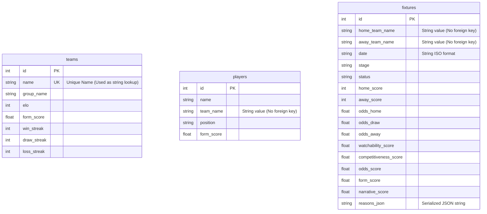
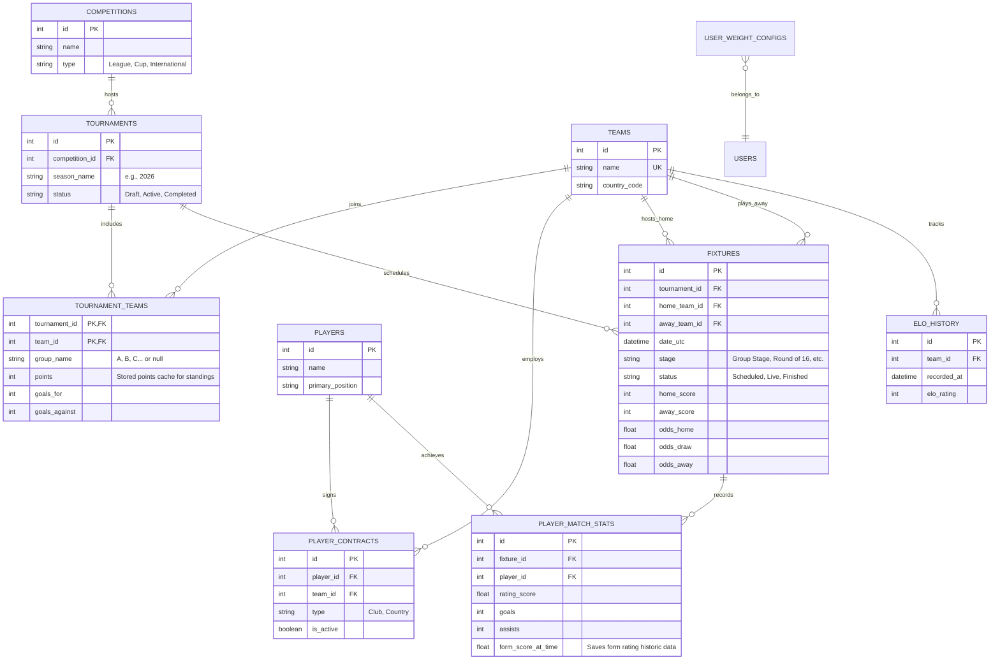

# Database & Architecture Analysis Report

This document provides a detailed analysis of the current database structure for the Football Match Watchability website and simulation system. It evaluates whether the database is future-proof, scalable, easy to extend, and suitable for both web and analytics workloads.

---

## 1. Executive Summary

| Dimension | Rating | Key Finding / Critique |
| :--- | :--- | :--- |
| **Future-Proofing** | 🔴 **Poor** | Severe lack of relational integrity. No foreign keys are used; teams and players are associated via fragile string lookups. The schema is hardcoded for a single international tournament. |
| **Scalability** | 🔴 **Poor** | SQLite is prone to write locks under multi-user concurrency. Inefficient schema design triggers the **N+1 query problem**, performing up to 80 separate queries to render a single list of fixtures. |
| **Ease of Extension** | 🟡 **Fair** | Flat tables make it initially easy to append columns, but connecting new data types (e.g., player stats, injuries) is highly error-prone due to string-based lookups and name collision risks. |
| **Ease of Use (Web & Work)** | 🔴 **Poor** | **Race Condition / Multi-User Conflict:** Dynamic scoring weights are stored in global memory and written directly into the main `Fixture` table. When one user updates weights, it alters the database globally, changing what *all* other users see. Date strings are stored as text instead of timezone-aware DateTime fields. |

---

## 2. Current Database Schema

The database uses SQLite, managed via SQLAlchemy. Below is a visual representation of the current schema, highlighting the **lack of relations**:



> [!WARNING]
> There are **zero foreign key constraints** linking `players` or `fixtures` to `teams`. String names (e.g., `home_team_name` or `team_name`) are used as proxy keys, which is extremely fragile.

---

## 3. Detailed Audit Findings

### 3.1 Is the Database Future-Proof?
**No, the database is not future-proof for the following reasons:**

1. **Hardcoded Tournament Paradigms:** 
   - The `Team` model contains a `group_name` column, implying a team can only belong to one group in a single tournament. This makes it impossible to support multi-tournament scenarios (e.g., domestic leagues + Champions League + World Cup).
   - The `Player` table assumes a player is only associated with one team (`team_name`). In reality, players belong to both a domestic club and a national country squad.
2. **Lack of Relational Integrity (String-Proxy Keys):**
   - Referencing teams by string names (e.g. `Fixture.home_team_name = "Spain"`) means any spelling change, capitalization mismatch, or country rename (e.g. "Côte d'Ivoire" vs "Ivory Coast") breaks the data connection.
   - If two teams have the same name, or if two players share a name (e.g. "John Smith"), string lookups fail immediately.
3. **Static ELO and Form Metrics:**
   - ELO and form are stored as current static columns on the `teams` and `players` tables. 
   - There is no history table. If you want to check what a team's ELO was *at the time of a match* three weeks ago, that information is lost. This makes backtesting watchability calculations or simulation accuracy impossible.
4. **No Schema Versioning (Migrations):**
   - The database is initialized using `Base.metadata.create_all(bind=engine)` on server startup.
   - There is no migration engine (such as Alembic). If you want to add or modify a column, you must drop the database and re-seed it (wiping out any user preferences, custom simulation logs, etc.).

### 3.2 Is the Database Scalable?
**No, both the file database choice and query logic are non-scalable.**

1. **SQLite Concurrency Locks:**
   - SQLite uses file-level locking for writes. In a multi-user environment where users are simulating outcomes, updating weights, or logging in, concurrent writes will block each other, leading to `database is locked` errors.
2. **The N+1 Query Problem:**
   - Because there are no real SQL relations (no foreign keys or ORM relationships), the application cannot perform SQL joins.
   - Inside `backend/services/tournament.py:enrich_fixture`, for *every single fixture* rendered, the backend performs **4 separate queries**:
     1. Find home team: `db.query(Team).filter(Team.name == f.home_team_name)`
     2. Find away team: `db.query(Team).filter(Team.name == f.away_team_name)`
     3. Find home players: `db.query(Player).filter(Player.team_name == f.home_team_name)`
     4. Find away players: `db.query(Player).filter(Player.team_name == f.away_team_name)`
   - To render a list of 20 fixtures, the server issues **80 separate SQL queries**!
3. **Missing Indexes on Query Columns:**
   - The lookup fields (`Player.team_name`, `Fixture.home_team_name`, `Fixture.away_team_name`) are string fields that do **not** have indexes.
   - Every single one of those 80 queries triggers a full-table scan. While fast on a local test database with 32 teams, it will choke on a league with thousands of fixtures and players.

### 3.3 Is it Easy to Add and Connect New Information?
**No, it is highly error-prone.**

- If you want to add **Player Match Statistics** (e.g., goals, assists, passes per fixture), you must create a new table. To link it, you would need to reference the player by string name and the fixture by ID.
- If a player's name is misspelled in one database table or API feed (e.g., "Vinicius Jr." vs "Vinícius Júnior"), the records fail to connect. Without numeric foreign keys, maintaining data integrity across data feeds (like odds APIs, livescore APIs, and ELO charts) requires complex string normalization wrappers (like `normalize_team_name` in `ingestor.py`).

### 3.4 Is it Easy to Use the Data for Both the Website and General Work?
**No, the architecture creates conflicts between web-serving and general analytics work.**

1. **The Shared-State Weight Disaster:**
   - When a website user adjusts the scoring weights (e.g., Elo vs Form weight) in `api_weights.py`, the backend recalculates scores and writes them directly to the main `fixtures` database table:
     ```python
     # Inside api_weights.py
     recalculate_all_fixture_scores(db, scoring_weights)
     ```
   - This writes to the global, shared table. If User A changes the weights to focus on Elos, **User B's screen will instantly change** because the underlying master table was mutated.
   - If the server restarts, weights reset to default because they are stored in a global Python dictionary `scoring_weights` instead of a user-session store or client cookie.
2. **Simulation Contamination:**
   - The simulation functions (`simulate_group_stage`, `simulate_bracket` in `tournament.py`) compute standings on the fly using temporary in-memory structures or by querying `fixtures`.
   - However, since there is no distinction in the database between "real played fixtures" and "simulated fixtures," you cannot easily store or log multiple simulation drafts, user brackets, or monte-carlo tournament pathways.
3. **Timezone Text Storage:**
   - Storing dates as string text (`"2026-06-11T12:00:00+00:00"`) requires timezone conversion inside application code every time a query is executed, leading to bloated services like `enrich_fixture`.

---

## 4. Proposed Redesigned Architecture

To make this database future-proof, highly scalable, and supportive of multi-tenant web applications and simulation scripts, we must transition to a relational structure with a clear boundary between master data and user-specific states.

### 4.1 Proposed Relational Schema



### 4.2 Handling Dynamic Watchability Weights (Solving the Multi-User Bug)

Instead of recalculating and writing watchability scores directly into the `fixtures` table:

1. **Read-Only Master Data:** The `fixtures` table only stores match facts (date, status, scores, odds) and historical stats.
2. **Calculate in Application Logic or View Layer:**
   - Calculations are done inside the query or service layer using a utility function:
     ```python
     def get_watchability(fixture: Fixture, weights: UserWeights) -> float:
         # Math calculations without writing to DB
         return score
     ```
   - This allows two different users to view the exact same fixture list with different weight setups simultaneously without database locks or data conflicts.
3. **Database Table for User Configurations:**
   - Store user preferences in a separate `user_weight_configs` table keyed by `user_id` or session, which the server loads to personalize the watchability scores dynamically.

---

## 5. Migration Roadmap

### Phase 1: Immediate Structural & Performance Fixes
* **Refactor Database Models:** Introduce `ForeignKey` constraints connecting `Player -> Team` and `Fixture -> Team` using integer IDs.
* **Add Missing Indexes:** Place indexes on `Player.team_id`, `Fixture.home_team_id`, and `Fixture.away_team_id` to speed up lookups.
* **Resolve N+1 Query Issue:** Modify CRUD functions and schemas to use SQLAlchemy's `joinedload` (e.g. `db.query(Fixture).options(joinedload(Fixture.home_team))` to fetch teams and spotlight players in a single SQL join query).

### Phase 2: Web Application and Routing Corrections
* **Fix the Weight Post API:** Stop writing calculated watchability scores directly to the `Fixture` table. Instead, calculate these scores dynamically inside the `enrich_fixture` JSON serializer using the request's specific weights.
* **Implement Alembic:** Add database migration tracking to ensure the database can evolve without wiping data.

### Phase 3: Simulation & High Performance
* **Simulation Sandboxing:** Create a clean separation between official fixture records and simulated records (e.g., utilizing an in-memory database copy or a session-specific simulation context).
* **Migrate to PostgreSQL:** Switch from SQLite to PostgreSQL to enable parallel connections, row-level locks, and strong transactional support.
